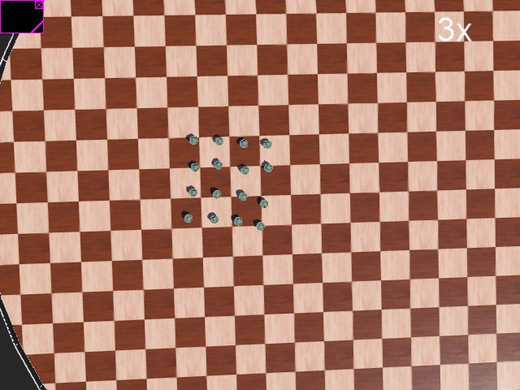
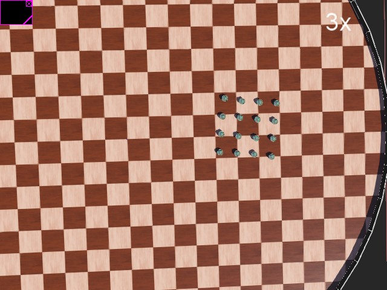

# Active Elastic Sheet（AES）
 Simple robot formation model, using AES method and implemented in [**Webots**](https://cyberbotics.com/).  
 Paper reference：[**Collective motion dynamics of active solids and active crystals**](https://iopscience.iop.org/article/10.1088/1367-2630/15/9/095011)  
 
   
   
 
 For more information:  
 　　[**Video1**](https://www.bilibili.com/video/BV1ma411F7XV)  
 　　[**Video2**](https://www.bilibili.com/video/BV1WK4y1L75p)  
   
   
   
    
    
